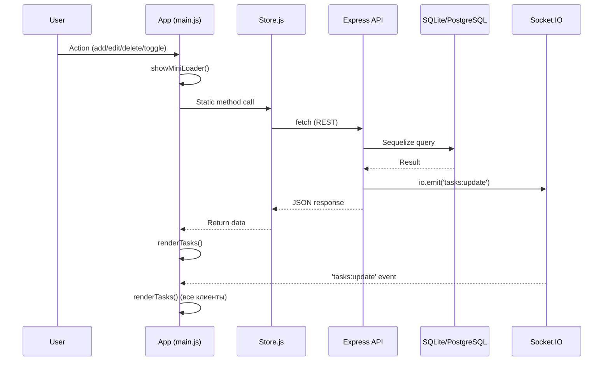

# 📇 Premium To-Do List — Project Index

## Overview

Full-stack To-Do app с **glassmorphism**-дизайном, real-time синхронизацией (Socket.IO), PWA, drag-and-drop и «умной корзиной».

| Layer | Stack |
|-------|-------|
| Frontend | Vanilla JS (ES Modules), Vite 7, SCSS (Sass), `socket.io-client`, `@lottiefiles/dotlottie-web` |
| Backend | Node.js, Express 4, Sequelize 6 ORM, Socket.IO 4 |
| Database | SQLite (dev), PostgreSQL (prod) |
| Deploy | Vercel (frontend), Render (backend + PostgreSQL) |

> [!CAUTION]
> **Запрещено** использовать React, Vue, Angular, Svelte. Строго **Vanilla JavaScript**.

---

## File Tree

```
Todo/
├── package.json              ← Root monorepo (concurrently)
├── render.yaml               ← Render deploy (backend + PostgreSQL)
├── vercel.json               ← Vercel deploy (frontend SPA)
├── .ai-context.md            ← AI правила и архитектурный контракт
├── README.md                 ← Документация проекта
│
├── backend/
│   ├── package.json          ← express, sequelize, socket.io, sqlite3, pg
│   ├── server.js             ← Express сервер + Socket.IO + REST API (293 строки)
│   ├── migrate.js            ← Скрипт миграции
│   ├── models/
│   │   └── Task.js           ← Sequelize модель Task
│   ├── .env.example
│   └── database.sqlite       ← Локальная SQLite БД
│
└── frontend/
    ├── package.json          ← vite 7, sass, socket.io-client, dotlottie-web
    ├── vite.config.js        ← Vite конфиг (publicDir, SCSS sourcemaps, host: true)
    ├── index.html            ← Главная HTML-страница (96 строк)
    ├── public/
    │   ├── manifest.json     ← PWA манифест
    │   ├── sw.js             ← Service Worker (Cache First + Network First)
    │   ├── cat.lottie        ← DotLottie анимация (5KB, пустое состояние)
    │   ├── cat.json          ← Lottie JSON (legacy fallback)
    │   └── icons/            ← PWA иконки
    └── src/
        ├── js/
        │   ├── main.js       ← Класс App — главный контроллер (501 строка)
        │   └── modules/
        │       ├── Store.js      ← HTTP-клиент (fetch wrapper)
        │       ├── TaskItem.js   ← DOM-фабрика <li> элементов
        │       ├── DragDrop.js   ← Drag & Drop (desktop + mobile touch)
        │       ├── EditModal.js  ← Модальное окно редактирования
        │       ├── Tooltip.js    ← Тултипы (4 позиции, viewport clamp)
        │       ├── TrashTimer.js ← SVG ring countdown (24ч TTL)
        │       └── Skeleton.js   ← Skeleton-загрузчики
        └── scss/
            ├── style.scss        ← Главный файл (@use всех партиалов)
            ├── _variables.scss   ← CSS Custom Properties (Design Tokens)
            ├── _base.scss        ← Reset, body, typography
            ├── _animations.scss  ← @keyframes, .removing, transitions
            ├── _layout.scss      ← .container, header, .background-globes
            ├── _forms.scss       ← .input-group, #add-btn, .char-counter
            ├── _tasks.scss       ← .task-item, .task-content, checkbox, DnD
            ├── _tooltip.scss     ← .tooltip, .tooltip--visible, позиции
            ├── _skeleton.scss    ← .skeleton-card, shimmer-анимация
            ├── _edit-modal.scss  ← .edit-modal, .edit-modal-overlay
            ├── _trash.scss       ← Trash UI, .trash-timer, restore-кнопка
            └── _media.scss       ← Responsive breakpoints
```

---

## Data Model — `Task`

Файл: [Task.js](file:///Users/aleksandrcervonnyj/Pet-Projects/Todo/backend/models/Task.js)

| Поле | Тип | Default | Описание |
|------|-----|---------|----------|
| `id` | INTEGER (auto) | — | Primary key |
| `text` | TEXT | — | Текст задачи (до 1500 символов на фронте) |
| `completed` | BOOLEAN | `false` | Статус выполнения |
| `order` | INTEGER | `0` | Порядок сортировки (ASC) |
| `isEdited` | BOOLEAN | `false` | Флаг «отредактировано» |
| `isDeleted` | BOOLEAN | `false` | Soft-delete флаг |
| `deletedAt` | DATE | `null` | Время удаления (для 24ч TTL) |
| `completedAt` | DATE | `null` | Время выполнения (для 1ч auto-trash) |
| `createdAt` | DATE | auto | Sequelize timestamp |
| `updatedAt` | DATE | auto | Sequelize timestamp |

---

## REST API

Файл: [server.js](file:///Users/aleksandrcervonnyj/Pet-Projects/Todo/backend/server.js)

| Method | Endpoint | Описание | Socket emit |
|--------|----------|----------|-------------|
| `GET` | `/api/tasks` | Активные задачи (`isDeleted: false`, сортировка `order ASC`) | — |
| `POST` | `/api/tasks` | Создать задачу (сдвигает `order` всех +1, новая получает `order: 0`) | `tasks:update` |
| `PUT` | `/api/tasks/:id` | Обновить текст или `completed` (авто-ставит `isEdited: true` при смене текста) | `tasks:update` |
| `PUT` | `/api/tasks/reorder/batch` | Пакетное обновление `order` в транзакции | `tasks:update` |
| `DELETE` | `/api/tasks/:id` | Soft-delete → корзина (`isDeleted: true`, `deletedAt: now`) | `tasks:update` |
| `GET` | `/api/tasks/trash` | Задачи в корзине (сортировка `deletedAt ASC`) | — |
| `POST` | `/api/tasks/:id/restore` | Восстановить из корзины | `tasks:update` |
| `DELETE` | `/api/tasks/:id/permanent` | Удалить навсегда (`task.destroy()`) | `tasks:update` |
| `GET` | `/health` | Health check (status, DB dialect, timestamp) | — |

**Автоматическая очистка**: `purgeExpiredTasks()` удаляет задачи из корзины старше 24ч. Запускается при старте + cron каждый час.

**Отложенное удаление**: `purgeCompletedTasks()` перемещает завершённые задачи (>1ч) в корзину. Запускается при старте + cron каждую минуту.

---

## Frontend Modules

### `App` — [main.js](file:///Users/aleksandrcervonnyj/Pet-Projects/Todo/frontend/src/js/main.js) (501 строк)

Главный контроллер приложения. Управляет состоянием, DOM-событиями, рендерингом.

| Метод | Описание |
|-------|----------|
| `constructor()` | Кэширует DOM-элементы, стартует `init()` |
| `init()` | `setupSocket` → `setupEventListeners` → `setupFilters` → `setupCharCounter` → `renderTasks(true)` |
| `setupSocket()` | Подключение к Socket.IO, debounce `tasks:update` (300ms) |
| `setupFilters()` | Фильтры All/Active/Done/Trash, сохранение в `localStorage` |
| `setupCharCounter()` | Счётчик символов (лимит 1500, yellow 90%, red 100%) |
| `addTask()` | Валидация → `Store.addTask()` → re-render |
| `deleteTask(id)` | `Store.deleteTask()` → re-render |
| `restoreTask(id)` | `Store.restoreTask()` → re-render |
| `permanentDeleteTask(id)` | `Store.permanentDeleteTask()` → re-render |
| `toggleTask(id, completed)` | `Store.toggleTask()` → re-render → Tooltip «⏰ In Trash in 1h» |
| `editTask(id, text, el)` | Открывает `EditModal` → `Store.updateTask()` → re-render |
| `handleReorder()` | Собирает DOM-порядок → `Store.updateOrder()` → синхронизирует локальный кэш |
| `renderTasks(initialLoad, skipFetch)` | Полный перерендер: fetch → filter → DOM rebuild |
| `_startTrashTimers()` | Интервальное обновление countdown таймеров (trash) |
| `_startCompletionTimers()` | Интервальное обновление countdown таймеров (completed, 1ч) |
| `_ensureLottieContainer()` | DotLottie анимация кота для «No tasks» |
| `_updateFilterCounts()` | Обновление badge-счётчиков на кнопках фильтров |

**Константы**: `MAX_CHARS = 1500`, `SOCKET_DEBOUNCE_MS = 300`, `TRASH_TIMER_INTERVAL_MS = 60000`, `COMPLETION_AUTO_TRASH_MS = 3600000` (1ч, должна совпадать с `COMPLETED_AUTO_TRASH_MS` в `server.js`)

---

### `Store` — [Store.js](file:///Users/aleksandrcervonnyj/Pet-Projects/Todo/frontend/src/js/modules/Store.js) (130 строк)

Статический HTTP-клиент. Все методы — `static async`. Базовый URL: `VITE_API_URL || 'http://localhost:3000'` + `/api/tasks`.

| Метод | HTTP | Endpoint |
|-------|------|----------|
| `getTasks()` | GET | `/api/tasks` |
| `addTask(task)` | POST | `/api/tasks` |
| `deleteTask(id)` | DELETE | `/api/tasks/:id` |
| `updateTask(id, text)` | PUT | `/api/tasks/:id` |
| `toggleTask(id, completed)` | PUT | `/api/tasks/:id` |
| `updateOrder(tasksWithOrder)` | PUT | `/api/tasks/reorder/batch` |
| `getTrashTasks()` | GET | `/api/tasks/trash` |
| `restoreTask(id)` | POST | `/api/tasks/:id/restore` |
| `permanentDeleteTask(id)` | DELETE | `/api/tasks/:id/permanent` |

---

### `TaskItem` — [TaskItem.js](file:///Users/aleksandrcervonnyj/Pet-Projects/Todo/frontend/src/js/modules/TaskItem.js) (277 строк)

DOM-фабрика. Создаёт `<li class="task-item">` с: drag-handle, checkbox, текст, кнопки edit/delete, timestamp, «edited» badge, expand/collapse (≥400 символов).

Для задач в корзине — кнопки restore/permanent-delete + `TrashTimer`.
Для выполненных задач (не в корзине) — inline badge `.completion-countdown` с обратным отсчётом до auto-trash (1ч).

SVG-иконки предкомпилированы как шаблоны (`DRAG_ICON`, `EDITED_ICON`, `RESTORE_ICON`).

---

### `DragDrop` — [DragDrop.js](file:///Users/aleksandrcervonnyj/Pet-Projects/Todo/frontend/src/js/modules/DragDrop.js) (153 строки)

Desktop: HTML5 Drag & Drop API (`dragstart`, `dragend`, `dragover`).
Mobile: Touch Events (`touchstart`, `touchmove`, `touchend`) с визуальным клоном.

Callback: `onReorder()` → `App.handleReorder()` → `Store.updateOrder()`.

---

### `EditModal` — [EditModal.js](file:///Users/aleksandrcervonnyj/Pet-Projects/Todo/frontend/src/js/modules/EditModal.js) (130 строк)

Singleton-модальное окно (все методы `static`). Анимируется от позиции карточки-задачи. Горячие клавиши: `Ctrl+Enter` сохранить, `Escape` закрыть. Валидация: пустой текст → Tooltip.

---

### `Tooltip` — [Tooltip.js](file:///Users/aleksandrcervonnyj/Pet-Projects/Todo/frontend/src/js/modules/Tooltip.js) (127 строк)

Инстанцируемый + статический `Tooltip.show(options)`. 4 позиции: `top`, `right`, `bottom`, `left`. Viewport boundary clamp. Auto-hide по таймеру. Ресайз → скрытие.

---

### `TrashTimer` — [TrashTimer.js](file:///Users/aleksandrcervonnyj/Pet-Projects/Todo/frontend/src/js/modules/TrashTimer.js) (193 строки)

SVG ring countdown. Конфигурируемый: `{ ttl, size, stroke, colors }`. Default TTL = 24ч. Экспортирует `DEFAULT_TTL_MS`. Методы: `computeProgress()`, `render()`, `updateInPlace()`.

---

### `Skeleton` — [Skeleton.js](file:///Users/aleksandrcervonnyj/Pet-Projects/Todo/frontend/src/js/modules/Skeleton.js) (30 строк)

Статические `render(container, count)` / `clear(container)`. Генерирует `<li class="skeleton-card">` с shimmer-анимацией.

---

## Design System

Файл: [_variables.scss](file:///Users/aleksandrcervonnyj/Pet-Projects/Todo/frontend/src/scss/_variables.scss)

| Token | Value | Назначение |
|-------|-------|------------|
| `--bg-color` | `#0f172a` | Тёмный фон (slate-900) |
| `--text-color` | `#f8fafc` | Светлый текст |
| `--primary-color` | `#6366f1` | Индиго (акцент) |
| `--secondary-color` | `#a855f7` | Фиолетовый (градиенты) |
| `--glass-bg` | `rgba(255,255,255,0.05)` | Стекло-фон карточек |
| `--glass-border` | `rgba(255,255,255,0.1)` | Бордер glassmorphism |
| `--glass-shadow` | `0 8px 32px rgba(0,0,0,0.37)` | Тень glassmorphism |
| `--input-bg` | `rgba(15,23,42,0.6)` | Фон инпута |
| `--transition-speed` | `0.3s` | Стандартная анимация |

**Шрифт**: [Outfit](https://fonts.google.com/specimen/Outfit) (300, 400, 500, 600) — preload + async load.

---

## Data Flow



---

## Ключевые правила (из `.ai-context.md`)

1. **Модуль `Store`** — единственная точка доступа к API. Никаких `fetch` вне `Store`.
2. **DOM** — прямая манипуляция, без VDOM. Структура `<li>` определена в `TaskItem.js`.
3. **Ошибки** — показывать через `Tooltip`, **не** `alert()`.
4. **Reorder** — синхронизация через `PUT /api/tasks/reorder/batch`.
5. **Socket.IO** — каждое изменение данных → `io.emit('tasks:update')` → все клиенты перерендерят.
6. **README.md** — обновлять при любых изменениях фич или архитектуры.

---

## Запуск

```bash
# Установка
npm install && npm run install:all

# Dev (Frontend :5173 + Backend :3000)
npm run dev

# Build
npm run build   # → frontend/dist/
```

| Env Variable | Description | Default |
|-------------|-------------|---------|
| `PORT` | Backend port | `3000` |
| `NODE_ENV` | `development` / `production` | `development` |
| `FRONTEND_URL` | Frontend URL для CORS | `http://localhost:5173` |
| `DATABASE_URL` | PostgreSQL connection string | — (использует SQLite) |
| `VITE_API_URL` | Backend URL для фронта | `http://localhost:3000` |
